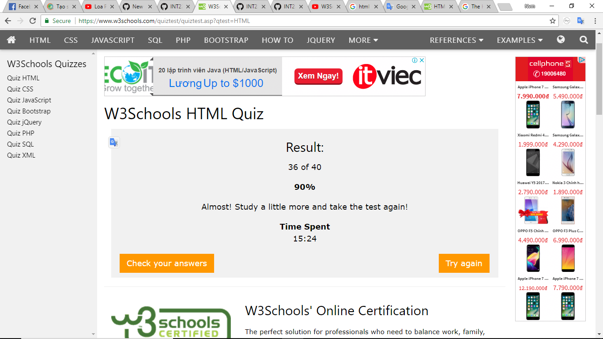
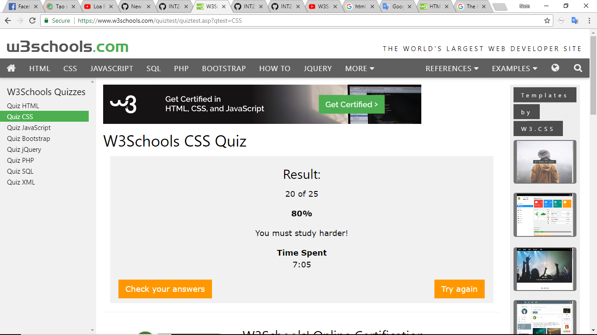
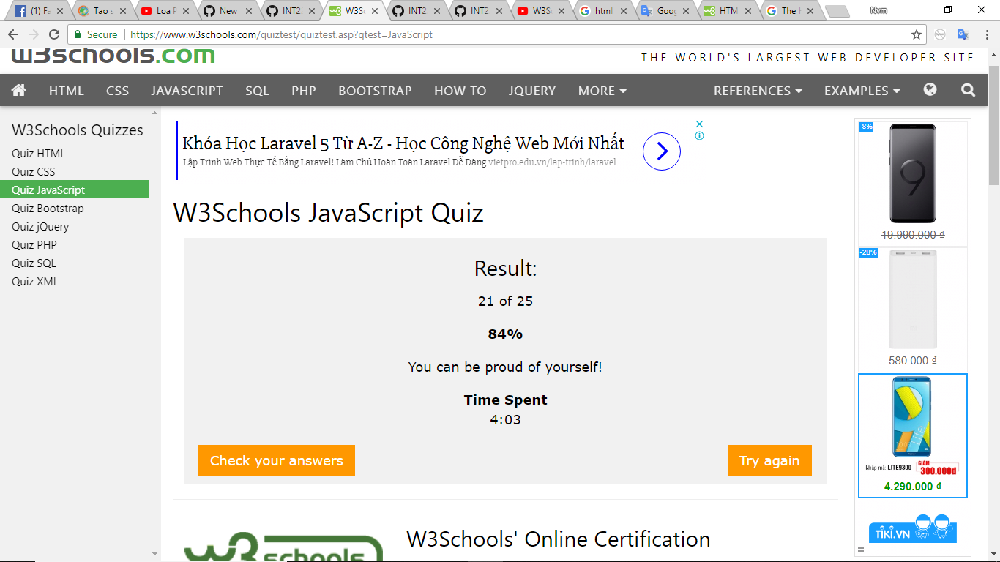
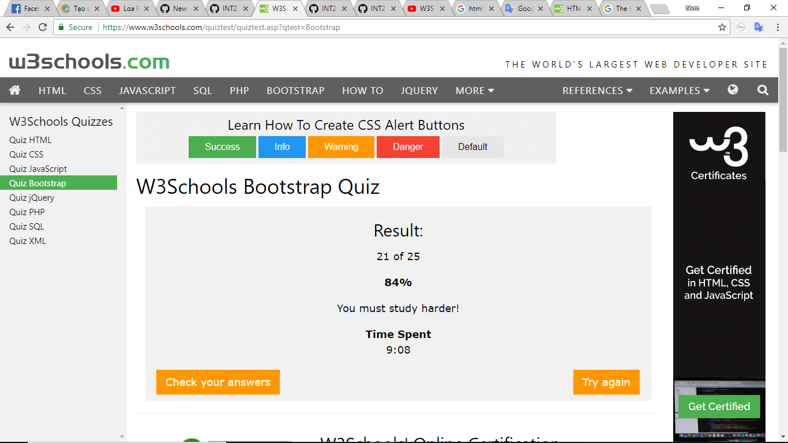

Tổng kết môn học:
Họ và tên : Nguyễn Văn Mạnh
Mssv : 16021046
I. Cá nhân:
- Hoàn thành học HTML, CSS, Boostrap, Javascript ở mức 80%.
trên w3school.com
image: 
* Bài Quiz HTML

Một số bài Quiz đã hoàn thành:
* Bài Quiz HTML

II. Bài tập nhóm:
- Đề tài : memrise
-Link btl : https://github.com/truonganhhoang/INT2208-4-2018/tree/master/nhom-11
- Dịch khóa học phần thiết kế cấp thấp và làm slide.

* Chấm chéo
    + Người chấm: Hà Thế Lực
    + Điểm: 8
    + Nhận xét: Làm bài tập nhóm, thuyết trình. Tự học tốt, có dẫn chứng đầy đủ. Bài tập cá nhân Software engineering chưa có

- Người chấm: Trần Quang Linh
- Điểm 7.5
- Nhận xét: tự học html, css, javascript, bootstrap tốt, tham gia làm slide + bài tập lớn cho nhóm nhưng chưa làm bài tập trên EDX

- Người chấm: Đỗ Huy Linh   
- Điểm: 8
- Nhận xét: 
    - Tự học thêm các kiến thức bổ trợ : html, css, bootstrap, javascript
    - Tham gia làm bài tập thuyết trình và bài tập lớn 
    - Chưa có thông tin bài tập cá nhân Edx
