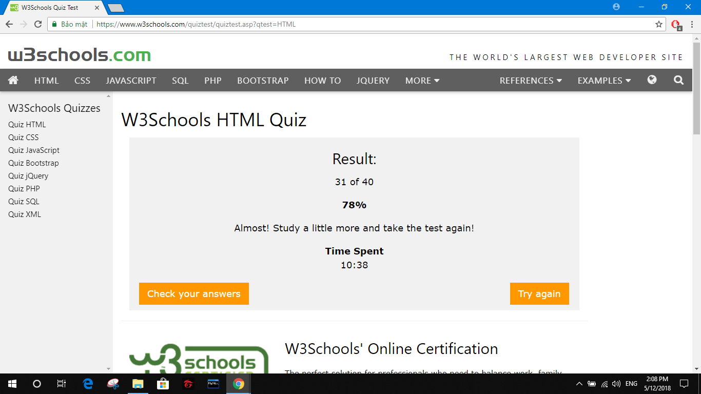
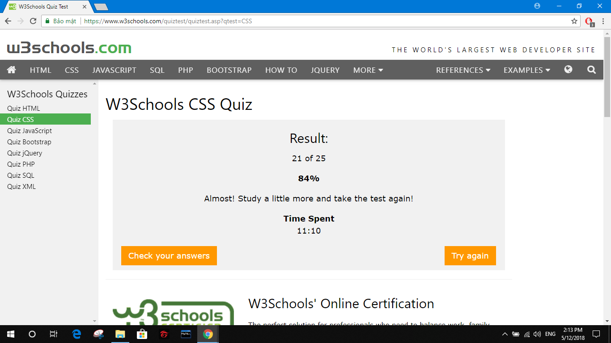
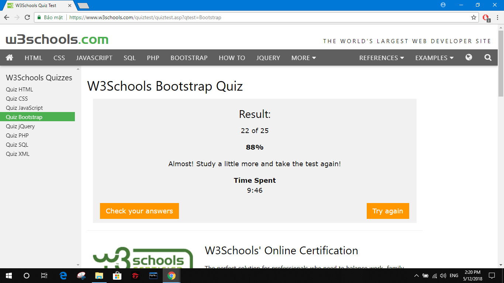
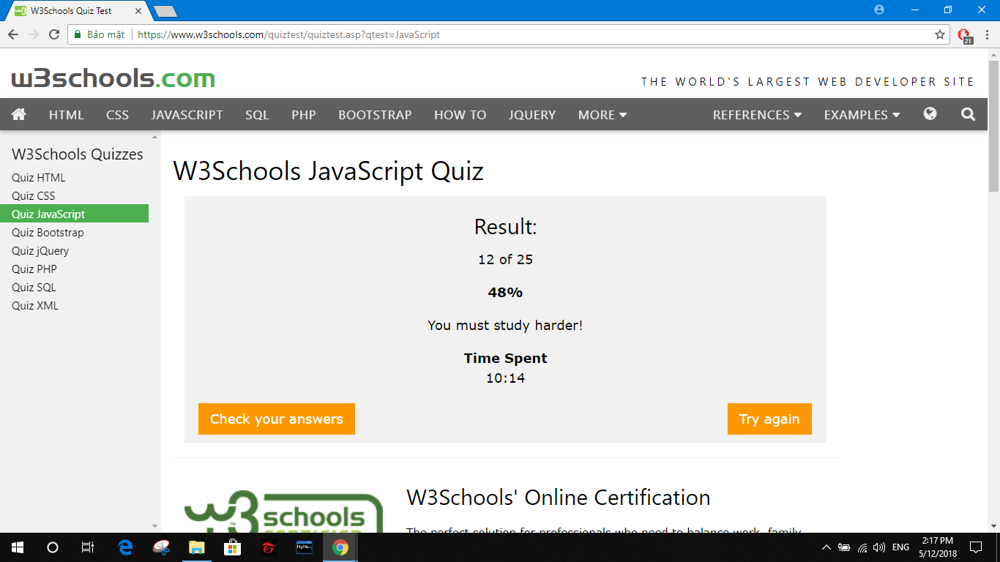
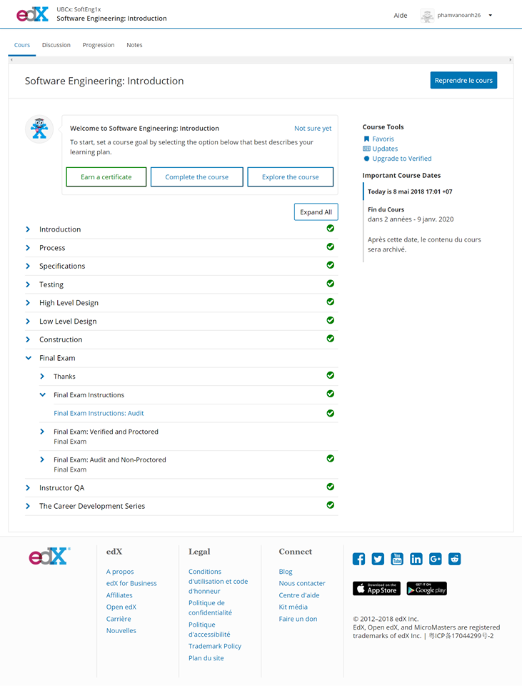

@@ -1,14 +1,14 @@
-Họ&Tên: Phạm Van Oánh MSSV:16021087;
 
+ 1.BT Nhóm
 	BTL: [Memrise](https://github.com/truonganhhoang/INT2208-4-2018/tree/master/nhom-11)
 	Báo cáo phần mềm: [Low level desgin](https://github.com/truonganhhoang/SoftEng/blob/master/low-level-design/nhom%2011/PITCHME.md)
 	Hoàn thành SEMAT
-2.Tự học
-	HTML và CSS, Bootstrap, JavaScript trên [W3School](https://www.w3schools.com)
+	HTML: 
	CSS: 
	Bootstrap: 
	JavaScript:
 	Software Engineering: lowlevel design 

3. Chấm điểm:
- Người chấm : Nguyễn Văn Mạnh.
-Điểm : 9.
-Nhận xét : 
* Bài tập lớn đã có minh chứng rõ ràng, từng phần cụ thể.
* Bài tập về nhà làm đầy đủ và có ảnh chứng minh.
* Tham gia làm slide thuyết trình nhóm.

-Người chấm: Nguyễn Đức Nhiên.
-Điểm : 9
-Nhận xét:
+ Tham gia vào làm bài tập lớn, bài tập nhóm đầy đủ.
+ Phần tự học tốt.

-Người chấm: Trần Thị Minh Nguyệt

-Điểm: 9

-Nhận xét: 

	+có minh chứng rõ ràng, cụ thể cho các mục.
	
	+Hoàn thành tốt công việc của nhóm
	
	+Phần tự học tốt.
	
