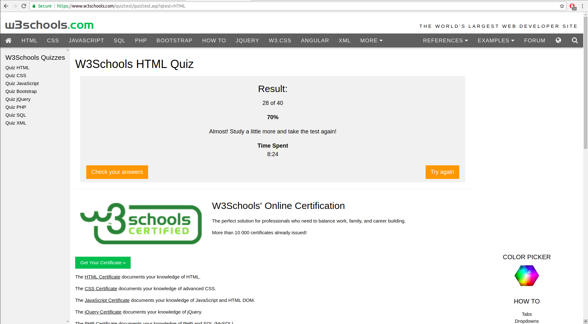
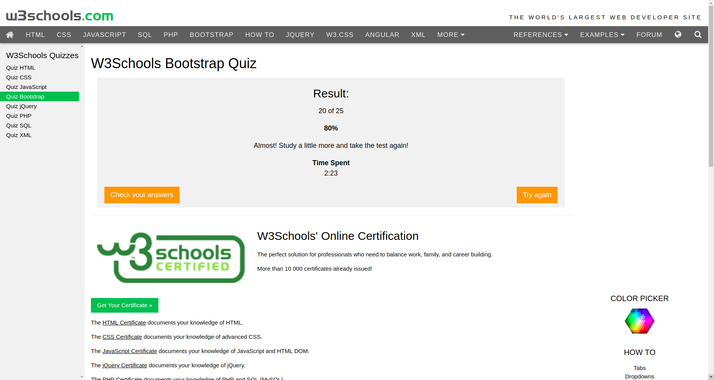
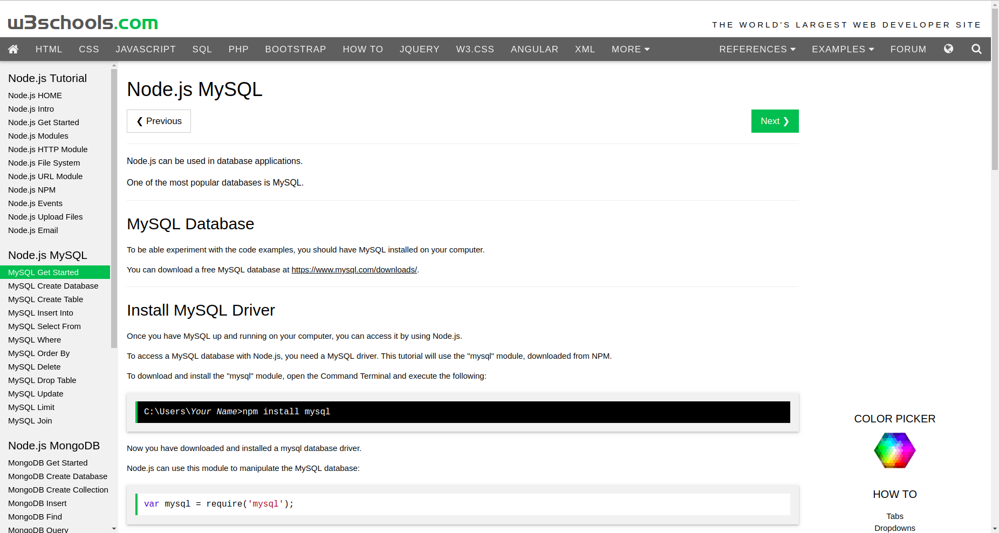
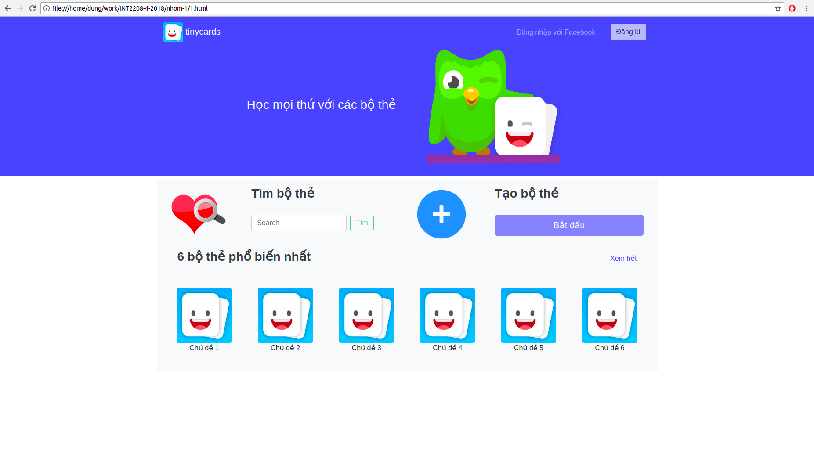
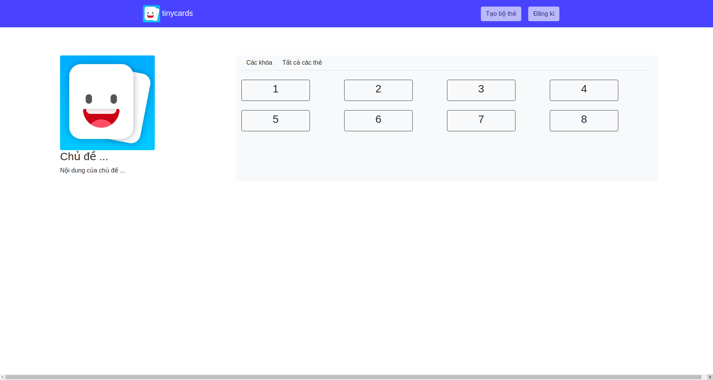
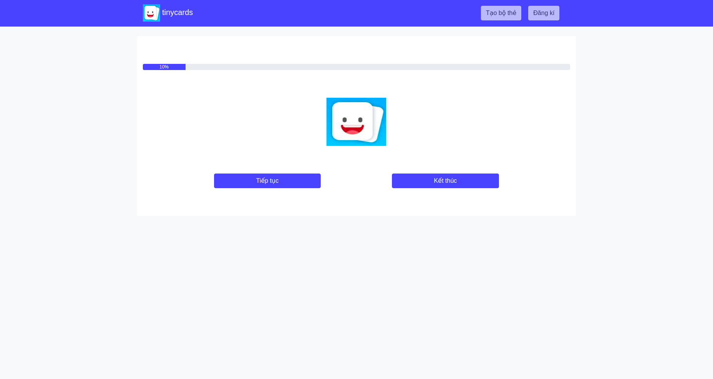

Sinh viên: Trần Anh Dũng

MSV: 15021770

Báo cáo tổng kết môn học:

I. Hoàn thành các khóa học HTML, Boostrap, NodeJS trên W3schools

Link khóa học:

https://www.w3schools.com/html/default.asp

https://www.w3schools.com/bootstrap/default.asp

https://www.w3schools.com/nodejs/default.asp

* Bài Quiz HTML

* Bootstrap 3:

* NodeJS - MySQL:

II. Áp dụng kiến thức được học vào Bài tập lớn: TinyCard Doulingo

Các chức năng chính:

Một số chức năng khác đang được hoàn thiện.

### Chấm điểm
- Người chấm: Nguyễn Mạnh Dũng
- Điểm: 7.5
- Nhận xét: 
  - Chưa có thông tin về bài tập cá nhân tuần 9-12 và ảnh về các quiz của khóa học trên [edx](https://www.edx.org/course/software-engineering-introduction-ubcx-softeng1x).
  - Chưa có thông tin về phần làm slide của khóa học trên [edx](https://www.edx.org/course/software-engineering-introduction-ubcx-softeng1x).
  - Đã có minh chứng về phần tự học html, bootstrap.
  - Bài tập nhóm có ảnh nhưng chưa nói rõ vai trò tham gia.

- Người chấm: Trần Thị Phương Anh
- Điểm: 8
- Nhận xét: Đã có bài tập lớn bài tập nhóm và tự học nhưng chưa có thông tin về bài tập cá nhân và bài tập làm slide của nhóm.
