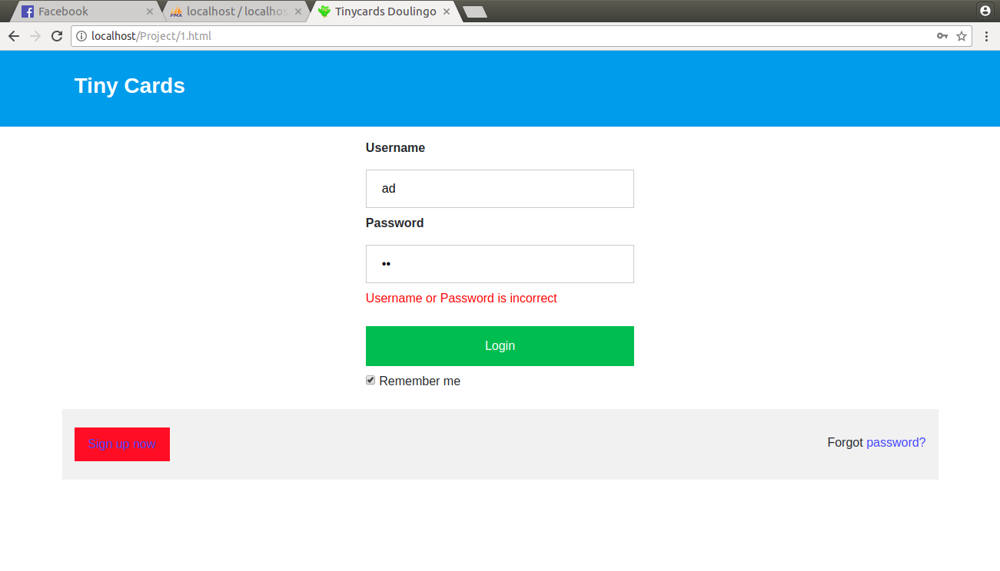
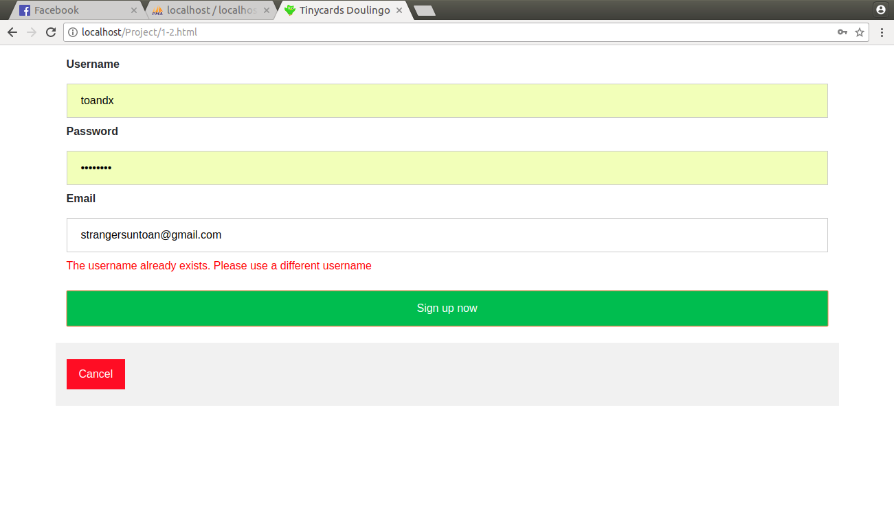
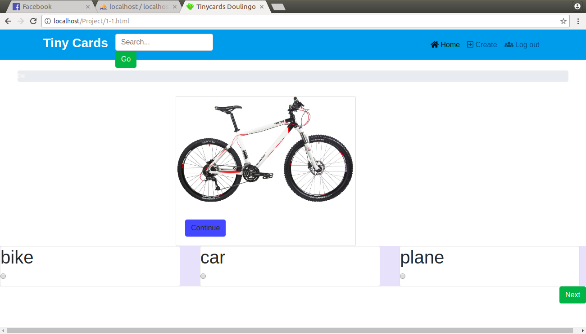
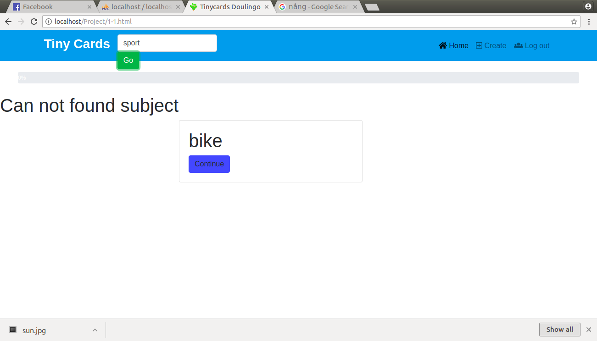

Dự án TinyCards bản hoàn thiện. Để chạy chương trình, bạn cần cài XAMPP Control Panel trên Windows (hoặc LAMPP trên ubuntu) , 
kích hoạt nó. Cài cơ sở dữ liệu web trên Database (Đây là khó khăn lớn nhất khi Deploy phần mềm lên các Server khác). Copy file 
FinalProject lên thư mục htdocs của XAMPP. Sau đó, chỉ cần truy cập vào localhost/FinalProject/1.html và sử dụng.
Chương trình có các tính năng chính:
* Đăng nhập: (1.html)
 
* Tạo tài khoản: (1-2.html)
 
* Chơi TinyCards:(1-1.html)
 
* Tạo thẻ, chủ đề:(1-1-1.html)
  
* Tìm chủ đề:

Các chức năng phụ:
* Tìm, xác minh, tạo tài khoản mới trong CSDL
* Tìm, tạo bộ thể, bộ chủ đề mới.
* Upload file ảnh lên CSDL

Mục đích của chương trình: Tạo ra môi trường học tập để người dùng có thể tạo ra các bộ thẻ, dễ dàng ghi nhớ.
